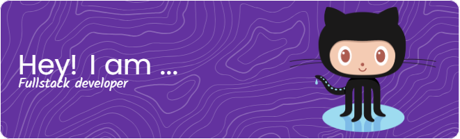

<!-- Header Banner -->
<p align="center">
  
</p>

<!-- Profile Badges -->
<p align="center">
  <a href="https://www.alifbima.my.id" target="_blank">
    
  </a>
  <a href="mailto:alifbima.dev@gmail.com">
    
  </a>
  <a href="https://github.com/4lifbima">
    
  </a>
</p>

<!-- Typing Animation -->
<p align="center">
  
</p>

---

## 👨‍💻 About Me

```javascript
const alifbima = {
    pronouns: "He" | "Him",
    education: "Informatics @ Universitas Negeri Gorontalo",
    currentlyLearning: ["Golang", "System Design", "Cloud Computing"],
    askMeAbout: ["Web Dev", "Tech", "Laravel", "Vue.js"],
    funFact: "I debug in my dreams 🐛💭"
};
```

<table>
  <tr>
    <td>🎓</td>
    <td><strong>Informatics</strong> student at <a href="https://www.ung.ac.id/" target="_blank">Universitas Negeri Gorontalo</a></td>
  </tr>
  <tr>
    <td>🌱</td>
    <td>Currently exploring <strong>Golang</strong> & Backend Development</td>
  </tr>
  <tr>
    <td>💻</td>
    <td>Daily driver: <strong>Visual Studio Code</strong></td>
  </tr>
  <tr>
    <td>🌐</td>
    <td>Portfolio: <a href="https://www.alifbima.my.id" target="_blank"><strong>alifbima.my.id</strong></a></td>
  </tr>
  <tr>
    <td>📫</td>
    <td>Reach me at <a href="mailto:alif67916@gmail.com"><strong>alif67916@gmail.com</strong></a></td>
  </tr>
</table>

---

## 🛠️ Tech Stack

<p align="center">
  
</p>

---

## 📊 GitHub Stats

<p align="center">
  
  
</p>

<p align="center">
  
</p>

<p align="center">
  
</p>

---

## 🏆 GitHub Trophies


---
[](https://visitcount.itsvg.in)

---

## 🐍 Contribution Snake

<picture>
  <source media="(prefers-color-scheme: dark)" srcset="https://raw.githubusercontent.com/4lifbima/4lifbima/output/snake.svg" />
  <source media="(prefers-color-scheme: light)" srcset="https://raw.githubusercontent.com/4lifbima/4lifbima/output/snake.svg" />
  
</picture>

---

<p align="center">
  
</p>

<p align="center">
  <sub>💡 <i>"Code is like humor. When you have to explain it, it's bad."</i></sub>
</p>
