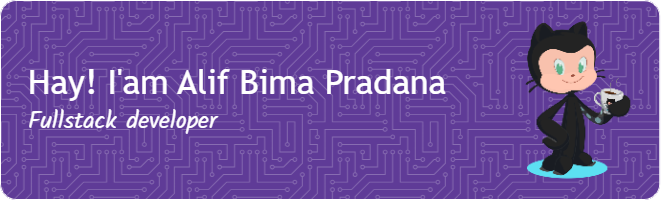

<h2 align="center">About Me</h2>

  📠&nbsp;I'm an <strong>Informatics</strong> student at <strong><a href="https://www.ung.ac.id/" target="_blank" title="Universitas Negeri Gorontalo">Universitas Negeri Gorontalo</a></strong> 
  🌱 &nbsp;I'm currently learning <strong>Golang</strong> 
  💻 &nbsp;I use <strong>Visual Studio Code</strong> 
  📫 &nbsp;Contact me at <strong><a href="mailto:alif67916@gmail.com" target="_blank" title="4lifbima/mail">alif67916@gmail.com</a></strong> 

<h2 align="center">Languages and Tools</h2>

  

 
<h2 align="center">GitHub Stats</h2>

  
   
  
  
  

###

